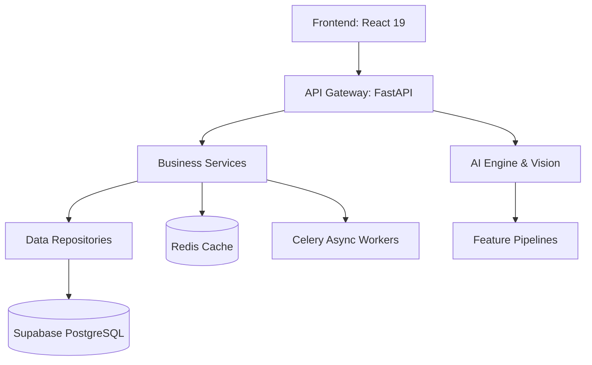

<div align="center">
  <h1>AEGON</h1>
  <p><strong>Enterprise Asset Intelligence Platform</strong></p>
  <p>
    An advanced, async-first platform for physical asset management, predictive maintenance, and operational intelligence, built for modern enterprise environments.
  </p>
  
  [](LICENSE)
  [](https://www.python.org/)
  [](https://fastapi.tiangolo.com/)
  [](https://react.dev/)
</div>

<br />

AEGON provides a unified control plane for complex industrial and physical asset ecosystems. By bridging the gap between raw IoT telemetry, visual intelligence, and business-critical logic, it delivers actionable insights directly to operators, engineers, and executives.

---

## Philosophy

AEGON is built on a strict, unyielding foundation of **Clean Architecture** and **Domain-Driven Design (DDD)**. We prioritize:
- **Separation of Concerns**: Repositories exclusively interact with the database. Business services encapsulate all business rules.
- **Python-First Intelligence**: Heavy computational workloads, analytics, and machine learning operate exclusively in the backend.
- **Deterministic UI**: The React frontend is completely agnostic to business logic. It visualizes data, captures intent, and delegates processing to the API layer.
- **Security by Design**: JWT, RBAC, and ABAC paradigms are enforced cross-cuttingly at every interaction boundary.

## Core Capabilities

- **Digital Twin Telemetry**: Real-time asset monitoring via WebSocket-driven data streams.
- **Enterprise Vision Intelligence**: Automated defect detection leveraging multi-source image acquisition (IP cameras, RTSP, mobile) and deployed ML models (e.g., YOLO, custom OpenCV pipelines).
- **Predictive Maintenance**: Historical degradation trend analysis to shift maintenance models from reactive to proactive.
- **Executive Copilot**: A Retrieval-Augmented Generation (RAG) assistant that grounds AI responses strictly in enterprise data and approved workflows, eliminating hallucination risks.

---

## System Architecture

The repository implements a distinct separation between presentation, application logic, and infrastructure:



## Technology Stack

- **Frontend**: React 19, TypeScript, TailwindCSS v4, TanStack Query, Framer Motion, Recharts.
- **Backend**: FastAPI, Pydantic v2, Dependency-Injector.
- **Database**: PostgreSQL (Supabase), SQLAlchemy 2.0 (asyncpg driver), Alembic.
- **Caching & Queues**: Redis, RabbitMQ, Celery.
- **Machine Learning**: Scikit-Learn, XGBoost, OpenCV.
- **Infrastructure**: Docker, Kubernetes ready, Terraform compliant.

---

## Project Structure

```text
aegon/
├── backend/               # FastAPI application
│   ├── alembic/           # Database migration revisions
│   ├── app/               # Core application logic
│   │   ├── api/           # REST endpoints and routing
│   │   ├── core/          # Configuration, security, and DI container
│   │   ├── models/        # SQLAlchemy ORM models
│   │   ├── repositories/  # Database access layer
│   │   ├── schemas/       # Pydantic DTOs
│   │   └── services/      # Domain business logic
│   └── tests/             # Pytest suite
├── frontend/              # React application
│   ├── src/
│   │   ├── components/    # Reusable UI elements
│   │   ├── features/      # Domain-specific components
│   │   ├── hooks/         # Custom React hooks
│   │   └── routes/        # Application routing
├── docs/                  # Architecture and engineering documentation
└── .github/               # CI/CD workflows and community health templates
```

---

## Quick Start

### 1. Prerequisites
- Python 3.12+
- Node.js 20+
- PostgreSQL database (Supabase recommended)
- Redis and RabbitMQ

### 2. Environment Configuration
Clone the repository and configure your environments. Never commit credentials to source control.

```bash
# Backend Configuration
cd backend
cp .env.example .env
# Edit .env with your DATABASE_URL and SUPABASE variables

# Frontend Configuration
cd ../frontend
cp .env.example .env
# Edit .env with your backend API URL
```

### 3. Local Development

Start the infrastructure stack and run the application services:

```bash
# Initialize database schema
cd backend
alembic upgrade head

# Start FastAPI server
uvicorn app.main:app --reload --port 8000

# Start React frontend in a new terminal
cd frontend
npm install
npm run dev
```

---

## Documentation

Detailed engineering documentation is available in the `docs/` directory:
- [Architecture & System Design](docs/Architecture.md)
- [Backend Services & Repositories](docs/Backend.md)
- [Frontend Component Standards](docs/Frontend.md)
- [Security Model](docs/Security.md)
- [Vision Intelligence Pipeline](docs/VisionIntelligence.md)

---

## Contributing

We welcome contributions from the engineering community. Please review our [Contributing Guidelines](CONTRIBUTING.md) and [Code of Conduct](CODE_OF_CONDUCT.md) before submitting pull requests. All code must adhere to our strict architectural principles and pass all automated tests.

## Security

If you discover a security vulnerability within AEGON, please consult our [Security Policy](SECURITY.md) for responsible disclosure instructions.

## License

This project is licensed under the MIT License - see the [LICENSE](LICENSE) file for details.
