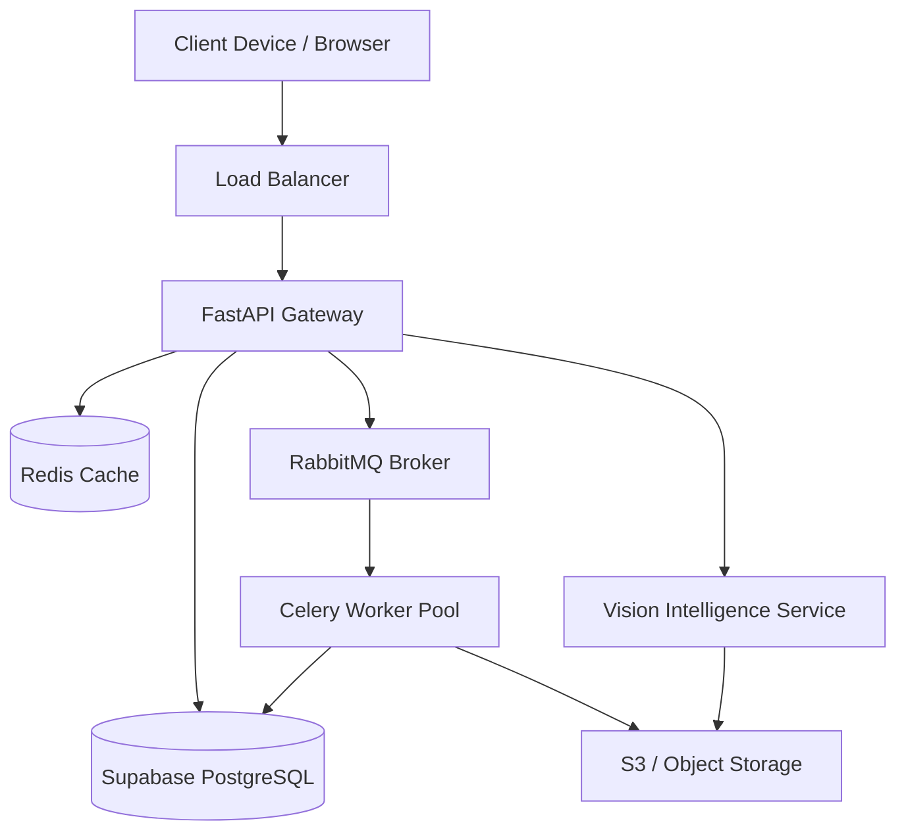

# System Design

This document details the high-level physical and logical component layout of the AEGON platform.

## Infrastructure Layout

AEGON relies on a modular, cloud-native infrastructure design that can be deployed across managed cloud providers (AWS, GCP, Azure) or on-premise Kubernetes clusters.

### Primary Components

1. **Frontend Proxy (CDN/Edge)**
   - Distributes the compiled React application.
   - Caches static assets globally.

2. **API Gateway & Load Balancer**
   - Routes ingress traffic to the appropriate backend FastAPI pods.
   - Terminates SSL/TLS.
   - Handles global rate limiting.

3. **Application Services (FastAPI)**
   - Stateless Python containers.
   - Scale horizontally based on CPU utilization and request queues.
   - Connect to the Database and Cache layers.

4. **Background Workers (Celery)**
   - Asynchronous Python containers that consume tasks from RabbitMQ.
   - Responsible for report generation, long-running data aggregations, and batch machine learning inference.

5. **Message Broker (RabbitMQ)**
   - Guarantees at-least-once delivery of background tasks.
   - Decouples the fast HTTP request/response cycle from heavy processing.

6. **In-Memory Cache (Redis)**
   - Caches computationally expensive KPIs and dashboard aggregations.
   - Maintains session state (if applicable) and distributed locks for background jobs.

7. **Primary Datastore (Supabase PostgreSQL)**
   - The single source of truth for all enterprise data.
   - Enforces relational constraints and referential integrity.
   - Utilizes `pgbouncer` or Supabase Session Pooler for efficient connection management.

## System Interaction Diagram

## Scaling Strategy

- **API Tier**: Scaled automatically based on request latency and CPU usage. Being stateless, nodes can be added or removed dynamically.
- **Database Tier**: Relies on read-replicas for heavy analytic querying. Connection pooling ensures the database does not exhaust available sockets during high load.
- **Worker Tier**: Scaled based on queue length. During intensive operations (e.g., end-of-month financial reporting), the worker pool can expand significantly to clear the RabbitMQ backlog.
